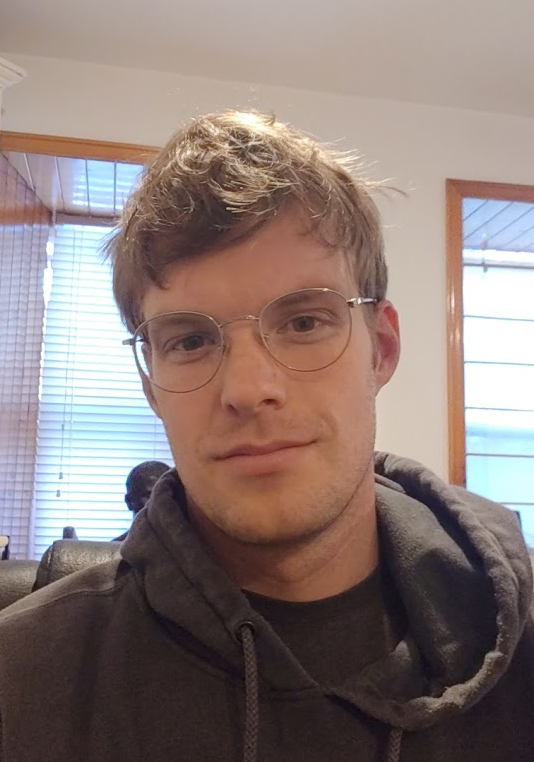

Hi! I'm Eric, and I'm a Senior Deep Learning Engineer at [Skydio](https://www.skydio.com) working on training and deploying efficient edge neural networks running on drones. You can download my CV [here]({{ site.url }}/pdfs/cv.pdf), and find me on google scholar [here](https://scholar.google.ca/citations?user=CcifQGgAAAAJ&hl=en) and LinkedIn [here](https://www.linkedin.com/in/eric-crawford-79a27613b).

In 2021 I graduated from [McGill University](https://www.mcgill.ca/) with a PhD in computer science, supervised by [Joelle Pineau](http://cs.mcgill.ca/~jpineau/), where I worked on reinforcement learning and building VAEs with structured (object-like) latent representations. The main focus of my PhD was *object discovery*, i.e. given a dataset of images/videos/interactions, how can we identify common objects in the dataset, learn to detect them, and maybe even reason about them. More concretely, I focused on how to build deep probabilistic neural networks that can learn to detect and track objects in the visual stream without supervision. I built systems that can discover objects in [images]({{ site.url }}/pdfs/spair_aaai_2019.pdf), [videos]({{ site.url }}/pdfs/silot_aaai_2020.pdf), and, most recently, [3D worlds]({{ site.url }}/pdfs/icml_ool_2020.pdf). I also explored how to build systems that can reason in terms of objects in ways that exploit their compositionality.

In 2014 I completed a Masters degree in Computer Science in the [Computational Neuroscience Research Group](http://compneuro.uwaterloo.ca/) at the [University of Waterloo](https://uwaterloo.ca/). I was supervised by [Chris Eliasmith](http://arts.uwaterloo.ca/~celiasmi/), and worked on a [biologically plausible model of human knowledge representation](https://github.com/e2crawfo/hrr-scaling). I also wrote an [MPI implementation](https://github.com/e2crawfo/nengo_mpi) of the [nengo](https://github.com/nengo/nengo) neural simulator. In 2012 I obtained a BMATH(CS) degree, also from Waterloo, and spent my co-op terms working on a GPU implementation of nengo using CUDA.

When not working I like to travel, hike, play sports (squash, running and ultimate currently), play board games, and read books, especially sci-fi and non-fiction. My favorite authors are Kim Stanley Robinson, Neal Stephenson, Greg Egan, and Dan Dennett.

## News
My paper [Learning 3D Object-Oriented World Models from Unlabeled Videos]({{ site.url }}/pdfs/icml_ool_2020.pdf)
received an Outstanding Paper Award at the Object-Oriented Learning workshop at ICML 2020.

## Conference / Journal Articles
[Exploiting Spatial Invariance for Scalable Unsupervised Object Tracking.]({{ site.url }}/pdfs/silot_aaai_2020.pdf)  
**Eric Crawford** and Joelle Pineau.  
*AAAI* (2020). [[code]](https://github.com/e2crawfo/silot) [[project]](https://sites.google.com/view/silot) [[supplementary]]({{ site.url }}/misc/silot_supp.pdf) [[arxiv]](https://arxiv.org/abs/1911.09033)

[Spatially Invariant Unsupervised Object Detection with Convolutional Neural Networks.]({{ site.url }}/pdfs/spair_aaai_2019.pdf)  
**Eric Crawford** and Joelle Pineau.  
*AAAI* (2019). [[code]](https://github.com/e2crawfo/auto_yolo) [[supplementary]]({{ site.url }}/misc/aaai_2019_supplementary.pdf)

[BanditSum: Extractive Summarization as a Contextual Bandit.](https://arxiv.org/abs/1809.09672)  
Yue Dong, Yikang Shen, **Eric Crawford**, Herke van Hoof and Jackie C.K. Cheung.  
*EMNLP* (2018).

[Modeling interactions between speech production and perception: speech error detection at semantic and phonological levels and the inner speech loop.](https://www.ncbi.nlm.nih.gov/pmc/articles/PMC4885855/)  
Bernd J. Kroger, **Eric Crawford**, Trevor Bekolay and Chris Eliasmith.  
*Frontiers in Computational Neuroscience* (2016).

[Biologically plausible, human-scale knowledge representation.]({{ site.url }}/pdfs/cogsci_2015.pdf)  
**Eric Crawford**, Matthew Gingerich and Chris Eliasmith.  
*Cognitive Science* (2015). [[code]](https://github.com/e2crawfo/hrr-scaling)

[Biologically plausible, human-scale knowledge representation.](https://mindmodeling.org/cogsci2013/papers/0099/paper0099.pdf)  
**Eric Crawford**, Matthew Gingerich and Chris Eliasmith.  
*Conference of the Cognitive Science Society* (2013). [[code]](https://github.com/e2crawfo/hrr-scaling)

## Workshops, Preprints, Theses, Reports
[Learning Object-Oriented Models of the Visual World.]({{ site.url }}/pdfs/phd_thesis.pdf)  
**Eric Crawford**.
*PhD Thesis, McGill University* (2021).

[Learning 3D Object-Oriented World Models from Unlabeled Videos.]({{ site.url }}/pdfs/icml_ool_2020.pdf)  
**Eric Crawford** and Joelle Pineau.  
*ICML Workshop on Object-Oriented Learning* (2020). **Outstanding Paper Award.**

[Spatially Invariant, Label-free Object Tracking.]({{ site.url }}/pdfs/silot_neurips_workshop.pdf)  
**Eric Crawford** and Joelle Pineau.  
*NeurIPS Workshop on Perception as Generative Reasoning* (2019). **Spotlight.** [[code]](https://github.com/e2crawfo/silot)

[Self-supervised Learning of Distance Functions for Goal-Conditioned Reinforcement Learning.](https://arxiv.org/abs/1907.02998)  
Srinivas Venkattaramanujam, **Eric Crawford**, Thang Doan, and Doina Precup.  
*arXiv preprint arXiv:1907.02998* (2019).

[Spatially Invariant Attend, Infer, Repeat.]({{ site.url }}/pdfs/spair_neurips_workshop.pdf)  
**Eric Crawford** and Joelle Pineau.  
*NeurIPS Workshop on Modeling the Physical World* (2018). [[code]](https://github.com/e2crawfo/auto_yolo) [[poster]]({{ site.url }}/pdfs/spair_neurips_workshop_poster.pdf)  

[Sequential Coordination of Deep Models for Learning Visual Arithmetic.](https://arxiv.org/abs/1809.04988)  
**Eric Crawford**, Guillaume Rabusseau and Joelle Pineau.  
*arXiv preprint arXiv:1809.04988* (2017).

[Policy Gradient Methods for Reinforcement Learning.]({{ site.url }}/pdfs/phd_comp.pdf)  
**Eric Crawford**.
*Ph.D. Comprehensive Exam, McGill University* (2015).

[Biologically plausible, human-scale knowledge representation.]({{ site.url }}/pdfs/masters_thesis.pdf)  
**Eric Crawford**.
*Master of Mathematics Thesis, University of Waterloo* (2015). [[code]](https://github.com/e2crawfo/hrr-scaling)

[Learning large-scale heteroassociative memories in spiking neurons.]({{ site.url }}/pdfs/voelker_2014.pdf)  
Aaron Voelker, **Eric Crawford** and Chris Eliasmith.  
*Unconventional Computation and Natural Computation* (2014).
